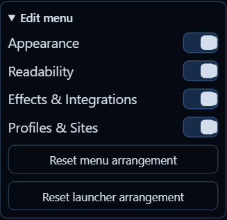

<p align="center"></p>

# exp-core

**A familiar menu across ExtraPotions**

The shared menu experience included with ExtraPotions products. No separate installation is needed.

[](LICENSE-CODE.md)
[](LICENSE-ASSETS.md)

## What you can do

- Choose menu palettes with visual swatches.
- Move and rearrange launchers; opening a product menu coordinates with the other installed menus.
- Reorder sections with their left handles and manage section visibility from System.
- Keep controls readable in narrow or short windows with menus that scroll inside the available space.

## Arrange your menu

Shown in SHIFT: choose which sections appear and reset their arrangement.



## Architecture

exp-core is the canonical implementation of shared ExtraPotions infrastructure. Product repositories consume a pinned released Core artifact; they do not define or feed shared behavior back into Core.

Shared launcher coordination, menu geometry and themes, diagnostics, notices, update chrome, compatibility controls, and other cross-product UI/runtime behavior belong here. Core also provides suite capability discovery, cross-product events, and shared page context so products can interoperate without importing one another's engines. Product role, suite priority, launcher placement priority, theme ownership priority, capabilities, presentation phases, and shared state schemas are defined once in the Core suite manifest. Known suite products cannot override those coordination fields at runtime; registration only supplies product identity, version, and product-specific state. Shared menu palettes are likewise published through the Core API, so theme ownership does not inspect another product's private DOM. Dropper, SHIFT, WARD, PRISMA, and future products keep only their product-specific engines and integrations.

A released Core update is synchronized into each consumer, verified byte-for-byte against the pinned Core tag, tested with that product, and prepared as a product patch release automatically.

## Included with your products

Install [Dropper](https://github.com/ExtraPotions/Dropper), [SHIFT](https://github.com/ExtraPotions/SHIFT), [PRISMA](https://github.com/ExtraPotions/PRISMA), or [WARD](https://github.com/ExtraPotions/WARD). The shared menu experience is included.

## License

**Code:** [PolyForm Noncommercial License 1.0.0](LICENSE-CODE.md)<br>
**Artwork and documentation:** [CC BY-NC-SA 4.0](LICENSE-ASSETS.md)

## About

exp-core is an independent project and is not affiliated with or endorsed by the websites where it is used.

## Running the tests without a browser download

Tests run in a real browser through Playwright. If you would rather use the Chrome or Edge you already have installed:

```
npm run test:installed-browser
```

To run Core together with Dropper, SHIFT, WARD, and PRISMA rebuilt on this Core, the same check CI runs before a release (the product folders must sit beside this one, each with `npm ci` done):

```
npm run suite:local
```

Set `EXP_BROWSER_PATH` to pick a specific browser. Your product folders are copied to a temporary workspace and never modified.
